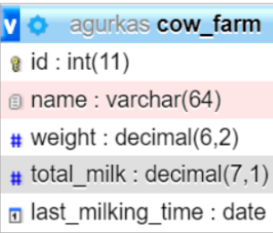

# Užduoties pristatymas

Užduoties sprendime reikia pademonstruoti visas technologijas, kurias išmokote kurso metu. Užduoties sprendime turi būti panaudotos sekančios technologijos: html, css (galima naudoti, bet neprivaloma sass, arba postcss arba bet kokį css karkasą bootstrap, tailwind ar panašų), serverio pusės javascript vykdymas node.js aplinkoje (galima, bet neprivaloma naudoti karkasą express.js, nest.js, sails.js ar panašų), kliento pusės javascript vykdymas naršyklėje būtinai panaudojant arba Angular karkasą arba React biblioteką ir duomenų saugojimui serverio pusėje panaudojant reliacinę duomenų bazę (MySQL arba MariaDB).

## Užduotis 1.
Sukurkite duomenų bazės lentelę pagal schemą:
 
Duomenų bazės pavadinimą sugalvokite patys. Jeigu reikia, duomenų bazės lentelę galite papildyti papildomais stulpeliais.

### Duomenų bazės implementacija

CREATE DATABASE Cow_Farm;
USE Cow_Farm;
CREATE TABLE Cows(
	id INT  AUTO_INCREMENT PRIMARY KEY,
	name VARCHAR(64) NOT NULL,
	weight DECIMAL(6, 2)  NOT NULL,
	total_milk DECIMAL(7, 1)  NOT NULL,
	last_milking_time DATETIME NOT NULL
)

INSERT INTO `cow_farm`.`cows` (`id`, `name`, `weight`, `total_milk`, `last_milking_time`)
VALUES (1, "Milka", 1000, 50.5, '2021-05-05 00:00:00');

## Užduotis 2.
Naudodami Angular karkasą arba React biblioteką sukurkite vieno puslapio aplikaciją (SPA), kurioje vartotojas galėtų atlikti pilną gyvulių fermos administravimą (CRUD). Kiekvienas gyvulys turi turėti savo vizualiai atskirtą aprašą, kuriame būtų pateikta visa informaciją apie jį. Šalia turi būti mygtukas “Trinti”, kurį paspaudus atitinkamo gyvulio įrašas būtų pašalinamas iš duomenų bazės. Šalia gyvulio svorio (kilogramais) turi būti laukelis su naujo svorio įvedimu. Šalia įrašo su paskutinio melžimo data turi būti laukelis su naujos datos įvedimu. Šalia laukelio su pieno kiekiu (litrais) turi būti laukelis, kuriame galima būtų įvesti tos dienos pieno kiekį. Dienos pieno (aka: vienos karvės, ne visų!!!) kiekis sumuojasi su bendru kiekiu ir suma įrašoma į duomenų bazę. Duomenų redagavimas turi būti atliekamas paspaudus “Redaguoti” mygtuką. Gyvulių aprašo viršuje (arba apačioje) turi būti atvaizduota tuščia forma su naujam gyvuliui įvesti ir mygtukas “Pridėti” formos vykdymui.

 ## Užduotis 3. 
 Serveryje sukurkite prisijungimą prie duomenų bazės, web serverį, maršrutizatorių ir visą bendravimo su naršykle logiką, užtikrinančią 2 užduoties įgyvendinimą serveryje. Informacijos apsikeitimas tarp serverio ir naršyklės turi vykti JSON formatu.

 ## Užduotis 4. 
Sukurkite naršyklėje esančio javascript bendravimo mechanizmą su serveriu, naudojant atitinkamus užklausų metodus, asinchroniškai siunčiamus į serverį. Dinamiškai renderinkite vaizdą naudodami Angular ar React, pagal duomenis JSON formatu gaunamus iš serverio.

 ## Užduotis 5.
Sukurkite statistikos laukelius, kuriuose būtų atvaizduojamas gyvulių kiekis ir bendras pieno kiekis (duomenys gaunami iš serverio duomenų bazės) Keičiantis duomenų bazės įrašams automatiškai turi keistis ir statistika.

  ## Užduotis 6.
Sukurkite rūšiavimo galimybę pagal gyvulio svorį ir pieno kiekį (sukurkite du mygtukus, kuriuos paspaudus gyvulių aprašai išsirikiuotų atitinkama tvarka). Tam panaudokite  Angular ar React galimybes (ne serverio).
Aplikacija turi atrodyti estetiškai ir turi būti padaryta adaptyvaus dydžio (responsive). Visi įvedami laukai turi būti tikrinami (kad nebūtų galima vykdyti SQL injekcijų ir k.t.) Vartotojui įvedus nekorektiškus/neteisingus duomenis turi būti parodomas pranešimas apie neteisingai įvestus duomenis. Vartotojui teisingai atlikus įvedimo/trynimo/redagavimo operaciją turi būti parodomas pranešimas apie sėkmingą operaciją. Galite prisidėti prie aplikacijos tobulinimo ir pridėti naujų, sąlygoje neaprašytų funkcionalumų ar vartotojo patirtį gerinančių patobulinimų. Papildomus dalykus užduotyje pridėkite tik tada, kai pilnai įvykdėte visas užduotis

